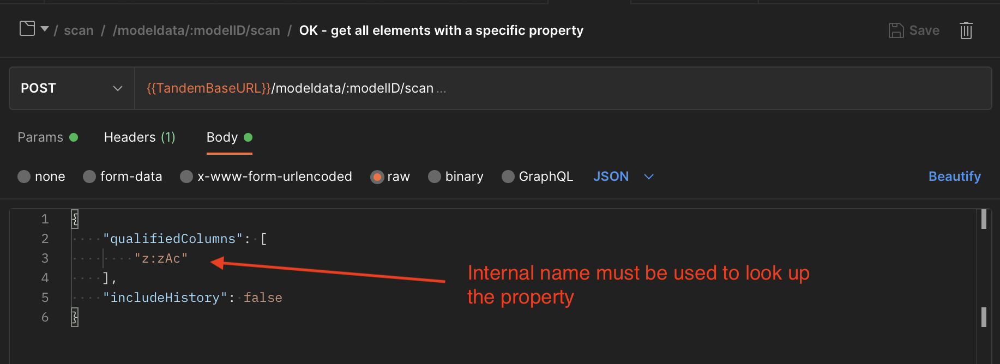
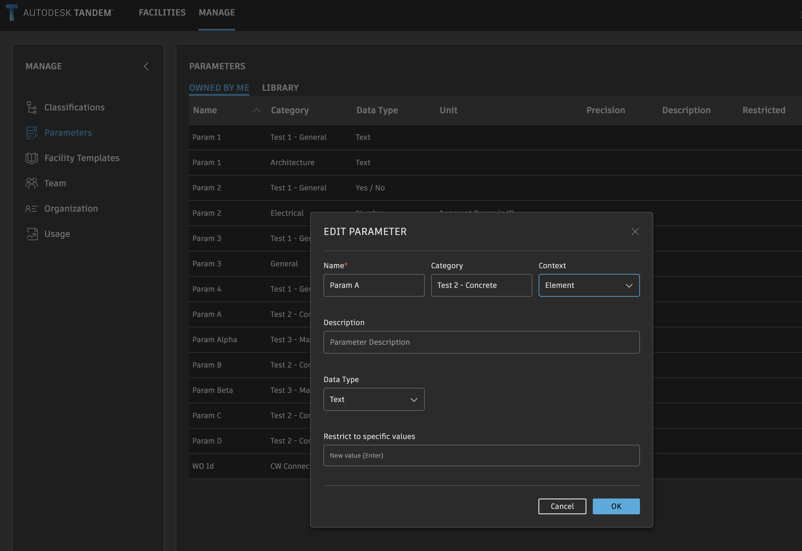
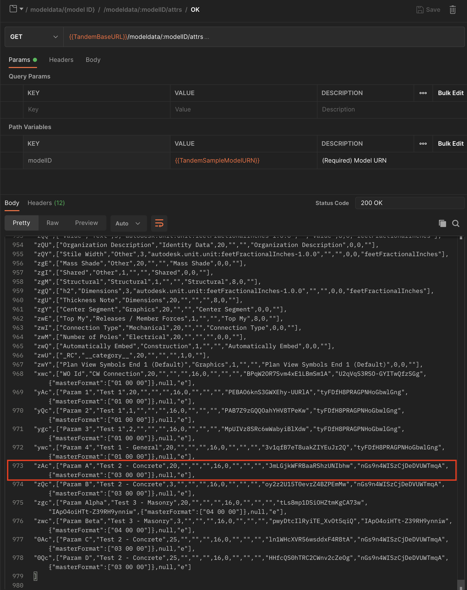
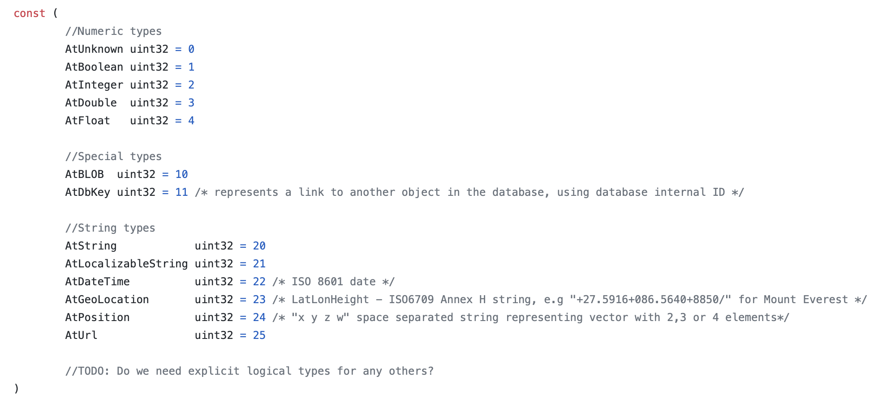
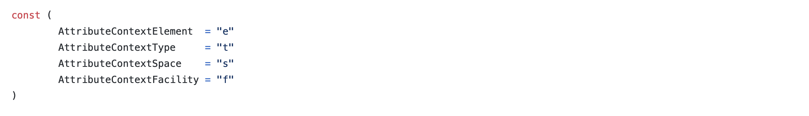
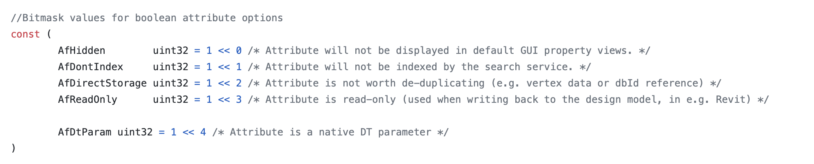
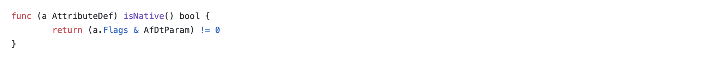

## Qualified properties

The /attrs and /schema endpoints are used to retrieve information about the properties that are available within Tandem.  Some properties are read-only and come from the design source files (e.g. Revit, IFC).  Other properties are defined in Tandem by the user and are read/write.

When reading property values via /scan or writing property values via /mutate, it is necessary to know information about the property definition.  For instance, both endpoints expect properties to be referenced by their internal "fully qualified" names.  As an example, here is a call to /scan to find all elements with the property "z:zAc" attached to it.



Most API users will need to establish a mapping table to move back and forth between the property's internal name and it's Display Name.  This mapping table can be created using the results of /attrs or /schema.

Let's start by looking at a property (aka "Parameter") in the Tandem product.



Obviously, the internal, qualified name does not show in the UI.  But we can retrieve that by getting the table of all properties using the /schema endpoint.


NOTE: the data returned from the /schema endpoint is easy to read because it is self-describing JSON where it is easy to find individual values.  However, it is not the most efficient way to build your mapping table and is missing some information about Classification assignments that you might want.  The Tandem client uses /attrs instead.

Here is similar output for a call to the /attrs endpoint:



This table of return values is more compact and more complete, but takes a little bit of logic to read correctly.  If we expand out a single entry to make it more readable...

```
"zAc"                            // internal name
[
  "Param A",                     // Name
  "Test 2 - Concrete",           // Category
  20,                            // DataType (see table for enum values)
  "",                            // DataTypeContext
  "",                            // Description
  "",                            // DisplayName
  16,                            // Flags (see table for bitmask values)
  0,                             // Precision (for float values)
  "",                            // ForgeUnit (not applicable for primitive data types)
  "",                            // ForgeSymbol (not applicable for primitive data types)
  "",                            // ForgeSpec (not applicable for primitive data types)
  "JmLGjkWFRBaaRShzUNIbhw",      // UUID
  "nGs9n4WISzCjDeDVUWTmqA",      // GroupUUID
  {"masterFormat":["03 00 00"]}, // ApplicationFilter (Classification mapping)
  null,                          // AllowedValues (only for specific properties)
  "e"                            // Context (where it can be attached, see table for enum values)
]
```

The above example is from a user-defined property, and is the kind you will most likely be interacting with via the API.  However, many properties originally came from the Revit or IFC source file, and they have a little bit less information, as shown in the following example.

```
"0AY",
[
  "Area",
  "Dimensions",
  3,
  "autodesk.unit.unit:squareFeet-1.0.1",
  "",
  "Area",
  8,
  0,
  "squareFeet"
]
```

You can see that the last 5 values do not appear in this case.  Those values are specific to user-defined properties.


Here are some screen shots of the internal structures that will help you parse this table.

Data Type enums:



Context enums:



Bitmask values for Flags field:



As an example of how to use the Flag field to check if this is a user-defined property, here is some internal code which does this:



NOTE: see the sample project for running code that builds this mapping table and has the enums defined: [Sample REST project](https://github.com/autodesk-tandem/tandem-sample-rest)
