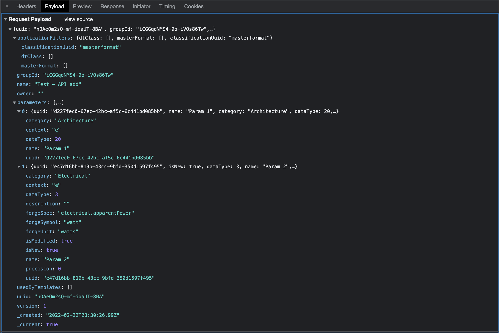
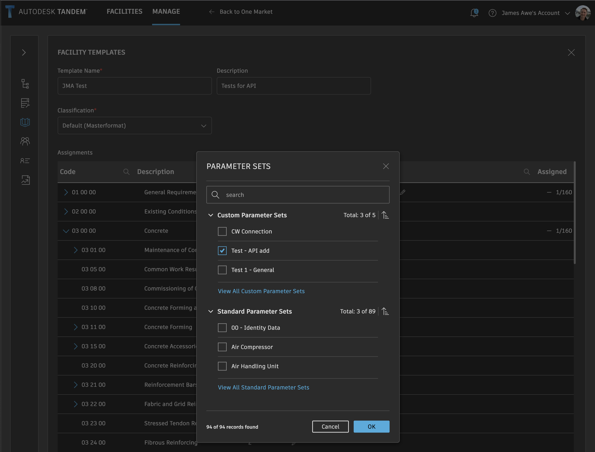

## Assigning Classifications and Parameters

We will examine this from the inside out, starting with just assigning a Classification to the element and well-known, fully qualified property names.  Those methods are well established and unlikely to change.  How to setup the Classifications and ParameterSets is a little more complicated and the methods are still evolving at the current time.

1. Assuming you know the fully qualified property name, how do I assign a new property to an element?

Let's first start with an element that has no user-defined parameters applied and no classification applied.

We can verify that is the case via a /scan call, like the following:

Now, we use /mutate to add the Classification for Concrete...

When we look at the Tandem UI now, we see the set of Parameters that *SHOULD* be there based on this Classification.  But there are actually no properties yet assigned to this element until these are defined.  We can verify this by running /scan on this element...

Now we will add two of the Properties from that ParameterSet and assign values to them by calling the /mutate function...

A subsequent /scan proves that they are there...

Once those properties are there, you continue to use /mutate with the "i" option to "Insert/Update" new values.

Currently, if you change to a new Classification, it will not remove these original properties that came from the previous classification assignment.  Notice in this screenshot that the classification has been changed to "Masonry", but both ParameterSets are present.

The process currently requires the Tandem User to run a "cleanup" operation on the database at some point to get rid of the stale mappings.

Or, you can run that process via calling the /cleanup endpoint via REST.

This returns a 202 code and works on it asynchronously.  Eventually, the UI in Tandem updates to reflect that those stale properties have been removed.

/cleanup is intended to be used as a bulk operation when the user has done many re-mappings and wants to clean out the old assignments.  If you know with precision which properties you want to delete, you can do that with the /mutate command and use option "d", as in the following example.

2. The above steps work to Add/Delete properties, assuming those properties exist in a ParameterSet and you know the fully qualified names.  But, how would you look up those names and know which properties came from ParameterSets that are associated to the element via Classification?

_DISCLAIMER:  this process is currently under re-design within Tandem to make assignment of properties more strict, and the API will likely be modified to both enforce these rules and to make it easier.  As of now, they are still individual steps and if not done correctly, can allow you to go "outside" of intended behavior for the product.  In other words, use at your own risk until these APIs finish evolving._

Let's start by observing what Tandem does when the user creates and manages Templates, Classifications, and ParameterSets.

When I create this...

It triggers the following call:

If I go back in and add a second parameter...

Notice the update is a PUT call...

When I now go to assign that ParameterSet to my FacilityTemplate, I assign it to "03 11 00" (Concrete Forming)

Which triggers...

However, notice that all the calls from the "Manage" tab of Tandem actually use endpoints from a different baseURL ("https://tandem.autodesk.com/app").  These are calling into the app-server and not the db-server.  They are managing the "global" Templates, Classifications, and ParameterSets for all Facilities, and are therefore not attached to any particular facility.  Unfortunately, these app-server endpoints are not public as part of the platform.  In addition, they are currently undergoing a re-design and are likely to change.  As a result, it is highly recommended that you use the Tandem product to manage Templates, Classifications, and ParameterSets manually.  Once the Template is applied to the Facility, then it is easy to follow the procedure outlined at the beginning of this document to add individual properties.

Once a Template is applied to a Facility, a copy of all the global constructs are imported into the database for that Facility and it is self-contained and no longer references the global constructs.  You can see how this is working in Tandem in the following screenshots.

When we make a change to any of the global constructs in the Manage tab, it is not immediately reflected in the Facility's copy of that data.  We have to update it manually, which forces a copy of a large JSON object that includes all those constructs, and then writes that into the Facility database

The update resulted in a call to POST /template

As you can see from the Payload, this requires you to know the structure and all the contents of Classification, the ParameterSets, and the mappings.  This is not an easy task and therefore, it isn't recommended at this time.

NOTE: there are two endpoints in the Postman Collection which are deprecated.  They were used in early versions of Tandem before the Facility Template mechanism was created.  These should not be used and will be removed soon.
- `{{TandemBaseURL}}/twins/:twinID/classification`  
- `{{TandemBaseURL}}/twins/:twinID/psets`  

You can get all the information associated with the global constructs via a call to /inlinetemplate, as in the following screenshot

Assuming that someone manually created the Template, Classification, and ParameterSets, and applied that Template to the given Facility, these ParameterSets are already setup and you just need to look up the fully qualified names. This can be done by calling the /attrs endpoint, as in the following example:

Here we see the "zAc" and "zQc" parameters we have been using in our example.  The fully qualified property name would then add the "z" family (which indicates a user-defined property).

This was the element key used throughout this example.  For your own use, you would have to use specific keys from your Facility, and specific fully qualified property names.

`AAAAAKljBWwVbUezt0cIIJETKaAAA9pl`
