## Documents

Tandem allows the upload of documents from ACC (Autodesk Construction Cloud). A copy of the document is made within Tandem but a reference is kept so that it can be updated when the original document is modified.  Once uploaded, Tandem issues it a URN that can be used in subsequent calls within the API.

Currently, the documents uploaded from Autodesk Documents (ACC) can only be of type PDF.

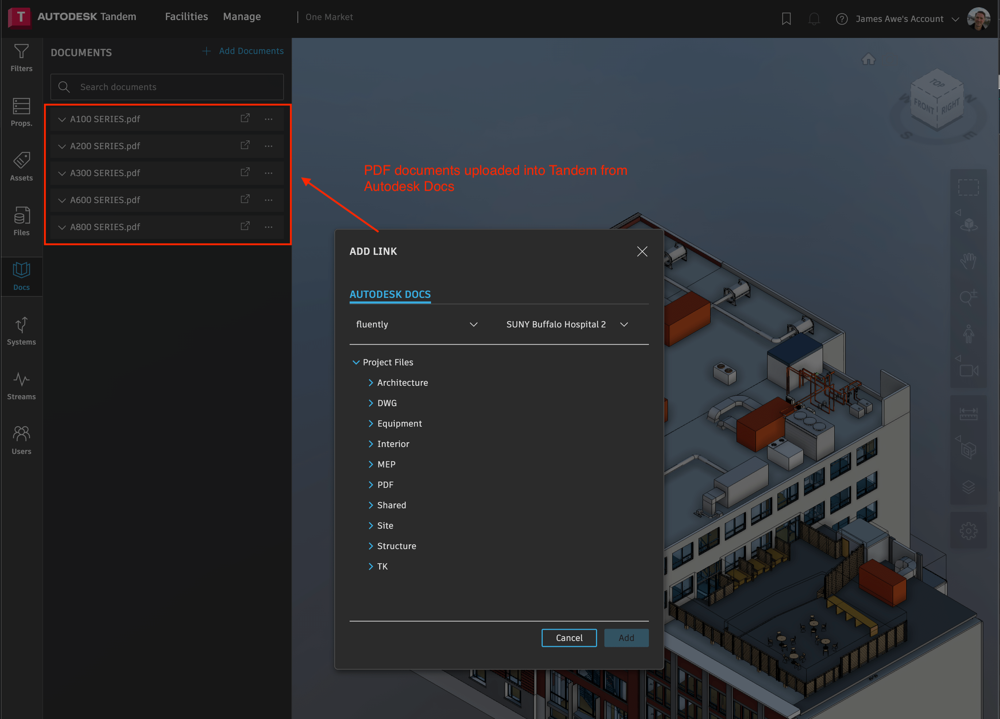

Tandem also allows you to make a simple Hyperlink reference and attach it to elements within the Facility.  In this case, no copy of the data is made and it is just a simple reference.  In order to add this link, we simply use the /mutate endpoint to change the value of that property like we would any other property.  See documentation on the /mutate endpoint for more information on how this is done.

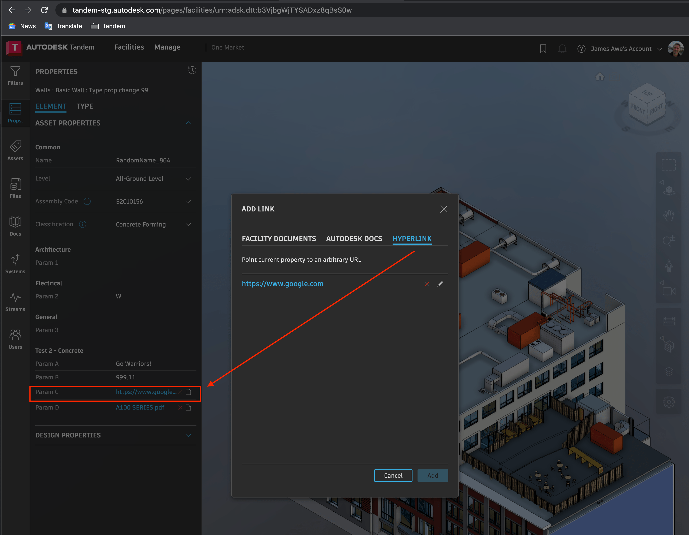
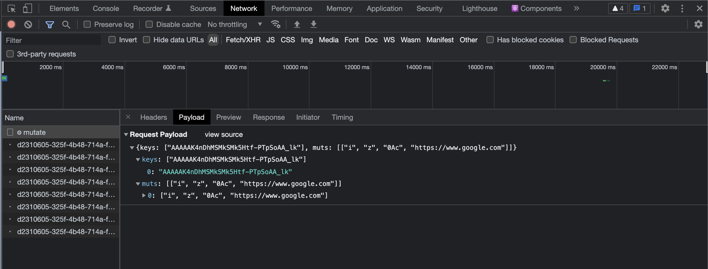

This same property value can also come from a document that has already been imported into this Facility (but is not assigned to this particular asset).  In this case, you must first retrieve the internally stored URN of the document within Tandem. Use the /twins/:twinID endpoint to get information about the Facility, which includes the internal document URNs. See the payload to the /mutate call below for an example.

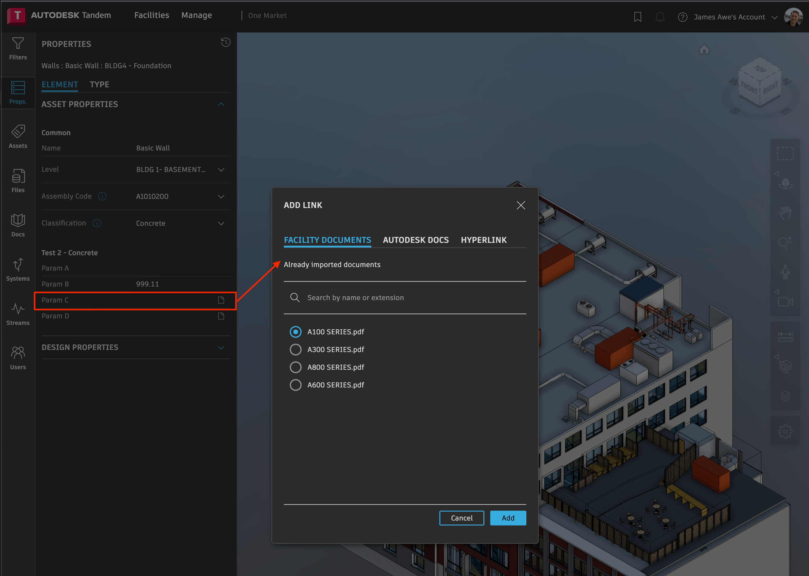
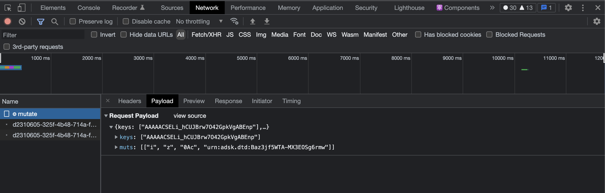

The 3rd option is to import from Autodesk Docs.

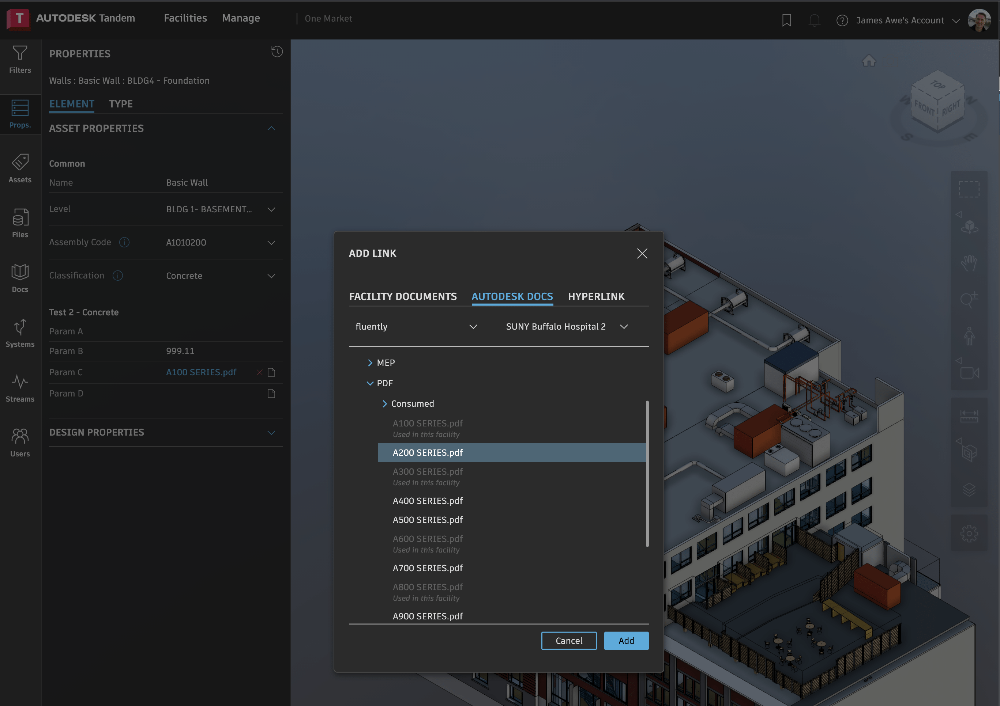

This requires you to first use the Forge Data Management APIs to access the information about available documents.  Then you use the /documentsbulk endpoint to upload that document into Tandem. Note that you use the "bulk" endpoint even if there is only one document.

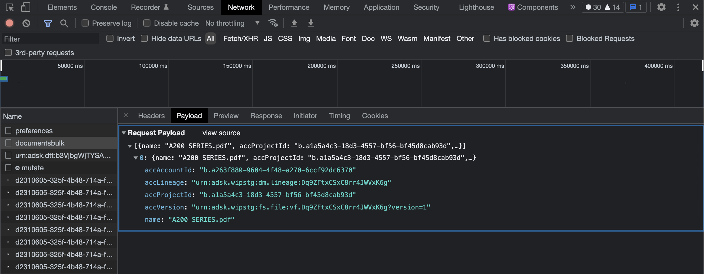

Then use the /twins/:twinID endpoing to retrieve the list of documents associated with the Facility.

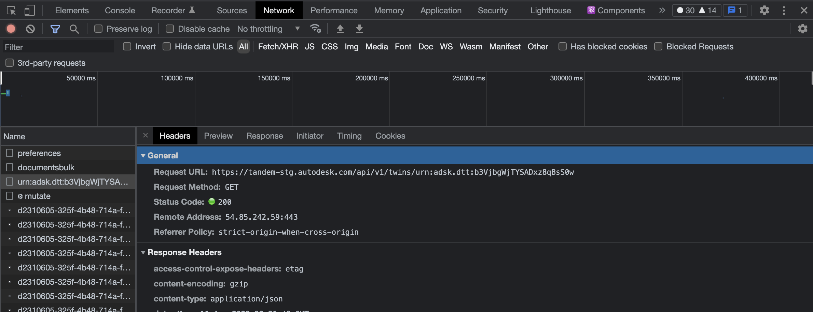
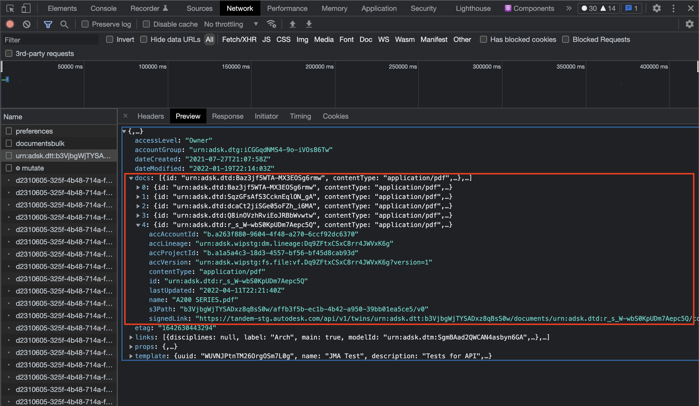

You can look up the URN that Tandem now uses internally and add that to the element property using /mutate, the same way we did before.

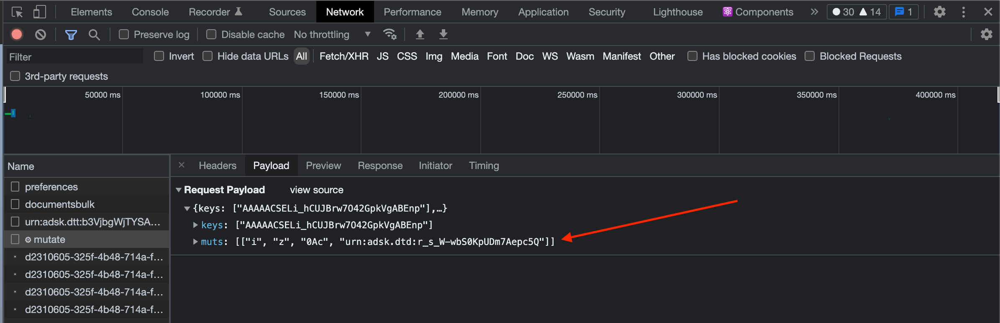

To retrieve information about a given document, you just need to know the internal Tandem URN of the particular document, as in the following example: `GET /twins/:twinID/documents/:documentID`   

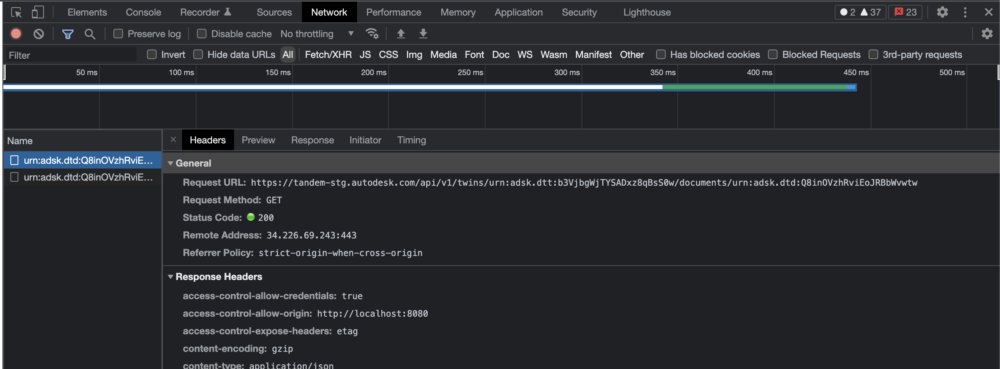
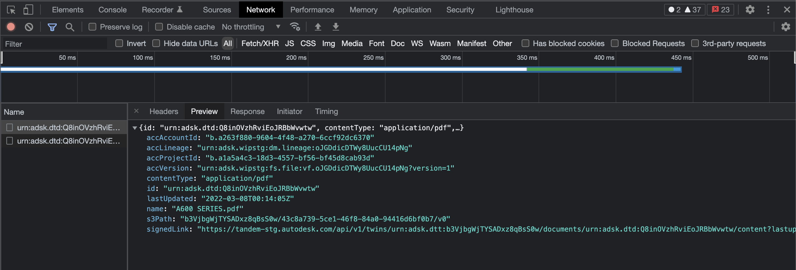

The content of the document can be retrieved in binary form by using: `GET /twins/:twinID/documents/:documentID/content`  

You can also use the value for `signedLink` (as in the image above) to show the contents in another browser window

The document can be deleted using the Tandem document URN and the following endpoint: `DELETE /twins/:twinID/documents/:documentID`

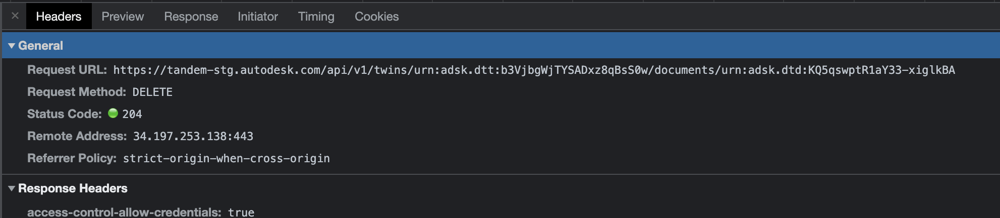
