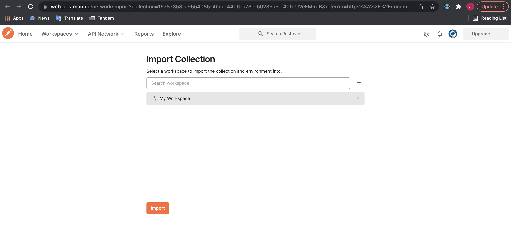
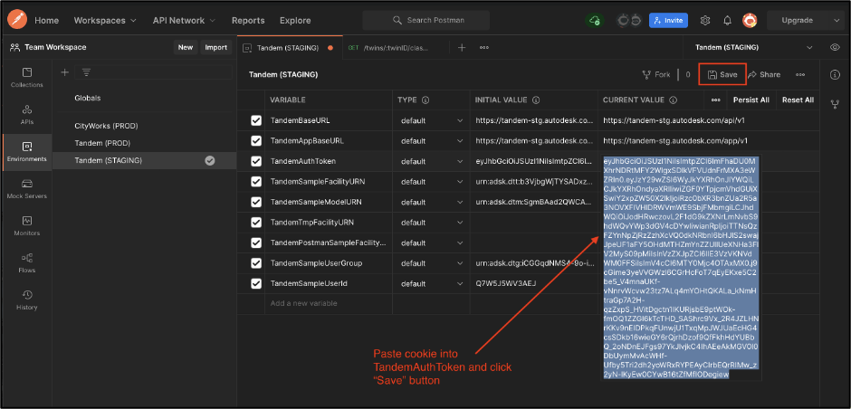
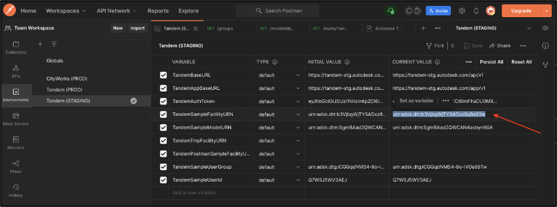

## Tandem API Postman Collection

Find the Postman  collection here: [Postman Collection](https://documenter.getpostman.com/view/15787353/UVeFMRdB)

Then import the collection into your workspace...

Then it should show up as a collection...

That should give you access to the documentation and the interactive collection.  The documentation for the REST API is only half finished, but hopefully being able to run interactively in Postman will help you figure things out.  The two major functions to READ/WRITE data are a little tricky:  
- `{{TandemBaseURL}}/modeldata/:modelID/scan`  
- `{{TandemBaseURL}}/modeldata/:modelID/mutate`  

There is a simple example saved in the Collection, but the full scope of these functions is much broader if you know all the flags to send it.  You can also cross-reference with the REST Sample code on GitHub. 

The Postman collection allows you to interactively test the Tandem REST API calls.  The collection is setup with certain environment variables that allow you to quickly substitute specific authorization tokens and model URNs in the pre-defined tests.

To set the TandemAuthToken variable, you can do the following:

Scrape an existing token from a running session of Tandem.

Paste that token into the Environment Variables in Postman.  Make sure to Save these changes.

Copy the URN of a specific Facility in Tandem

Paste the URN into the environment variable for TandemSampleFacilityURN.  Make sure to Save these changes.

Now go to the Collection and select a specific REST endpoint.

For a complex call like /scan, there are several variants stored as examples.  You can quickly see the call and response from previous calls I have made.  If you want to do your own dynamic call, copy the body of the request, then go into the POST entry for /scan and paste that into the body of the call, change any values you want, then hit Send to get a new result.

