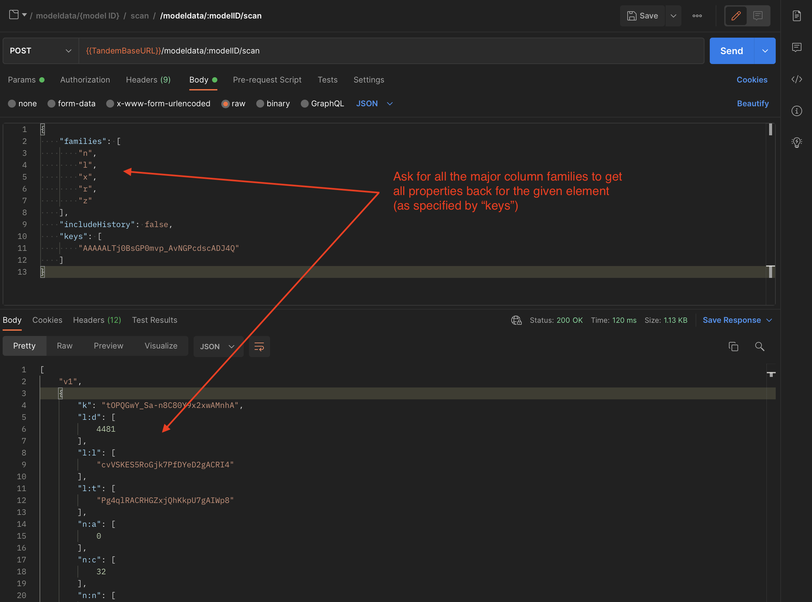

## Reading properties - /scan

The /scan endpoint is used to retrieve property data from the backend database.  The API is designed to be very efficient and therefore is not very developer friendly on first use.  At a later date, the plan is to provide an abstraction layer that makes this easier to use.

The first thing to understand is the structure of the Tandem data model.  Imagine it as a sparse 3D Matrix, where rows are elements in the model, columns are attributes, and the third dimension is the history of values that property has had over time.

The columns (attributes) are grouped into “families”, each of which is depicted by a hard-coded character specification (shown below).

Some column names within each family are hardcoded in the Tandem schema.  For instance, "n:n" is the well-qualified name for the Standard attribute "Name".

Some column names are dynamically generated, as is the case when a Tandem user creates and applies a ParameterSet with user defined properties.  As an example, "z:XYZ".  Any column that begins with the prefix "z" is user-defined.

Let's suppose you want to retrieve all properties associated with a given element, like in this screenshot from Tandem after selecting the Wall object:

If all properties are desired in the request, you would include something like the following:

If you also want the Type properties, you have to also include the "key" for the Type object of that particular wall (the "Wall Family" in Revit terms).

If we wanted ONLY the user-defined properties on the given element, we would just include the "z" family, as in the following example:

Now let's suppose we only want to retrieve a SINGLE user-defined property.  If we know the "fully qualified" name, scan/ will only return that requested property (if it exists on that Element).

The response format for /scan is an array of “things”. The first element is always a version, representing the format used (currently it is always “v1”).  The array will have a return value for each corresponding "key" that was specified.  If the "includeHistory" flag was true, each property returned may have multiple values with a timestamp.

One of the most powerful versions of /scan is when you do NOT specify any specific elements.  In this case, it will search for all elements that have the given property attached, as in the following example:

Here, we have specified a qualified column for the property "z:zAc", and /scan returns us all elements that have that property attached.

### Looking up Display Names

Obviously, qualified names like "z:zAc" or "n:n" are not suitable for display to the user.  There is another REST endpoint /schema that will allow you to convert back and forth between DisplayName and Column name.

There is another endpoint called /attrs which is more efficient and is used by the Tandem client app to construct a property mapping table.  It can be seen here...

This is what the sample REST project uses to make a mapping table between fully qualified column names and Display Names used in the UI.

_NOTE: /scan works on a per-model basis, so if you have 3 models loaded and have elements from each model you want the properties for, you need to call it 3 separate times._
