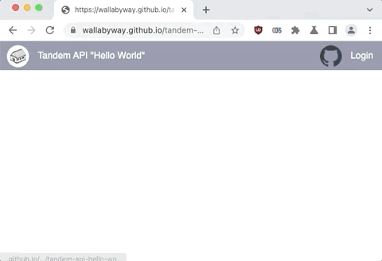

# Hello World Example

This is the Hello World tutorial...

DEMO: [https://wallabyway.github.io/tandem-api-hello-world/](https://wallabyway.github.io/tandem-api-hello-world/)

REPO: [https://github.com/wallabyway/tandem-api-hello-world/](https://github.com/wallabyway/tandem-api-hello-world/)




#### Create an index.html with the following code:

```html
<html manifest="example.appcache">
<header>
    <link href="https://tandem.autodesk.com/viewer/style.min.css" rel="stylesheet" type="text/css">

    <style>
        body { font-family: helvetica;sans-serif; margin: 0; padding: 0; overflow: hidden;}
        .nav ul { background-color: rgba(20,30,70,0.5); list-style-type: none; margin: 0; padding: 5px; position: fixed; top: 0; width: 100%; z-index: 10}
        .nav li a { color: white; text-decoration: none; }
        .nav li img { height: 38px; border-radius: 50%; padding:2px}
        .nav li { float: right;  display: block; padding: 0 8px 0 5px; height: 40px; line-height: 40px; }
        .nav .nleft { float: left }
    </style>
</header>

<body>
<div class="nav"><ul>
    <li class="nleft"></li>
    <li class="nleft"><a href="https://intandem.autodesk.com">Tandem API "Hello World"</a></li>
    <li><a href="#" id="userprofile">Logout</a></li>
    <li><a href="#" id="autodeskSigninButton">Login</a></li>
    <li><a href="https://github.com/wallabyway/tandem-api-hello-world/"></a></li>
</ul>
</div>
<div id="viewer" style="height: 99.7%; width: 100%;"></div>
</body>

<script type="module">

const $ = (id) => {return document.getElementById(id)};
const show = (id) => { $(id).style.display="block"};
const hide = (id) => { $(id).style.display="none"};
const av = Autodesk.Viewing;


class login {
    constructor( forgeClientID, defaultFacilityURN ) {
        $('autodeskSigninButton').addEventListener("click", (e) => {this.redirect(e)});
        $('userprofile').addEventListener("click", (e) => {this.logout(e)});
        this.clientID = forgeClientID;
        this.facilityURN = defaultFacilityURN;
        this.scope = "data:read";
        this.redirect_uri = encodeURIComponent(location.href.split('#')[0]);
        this.token = window.sessionStorage.token;
        this.renderUI();
    }

    redirect() {
        debugger;
        location.href = `https://developer.api.autodesk.com/authentication/v1/authorize?response_type=token&client_id=${this.clientID}&redirect_uri=${this.redirect_uri}&scope=${encodeURIComponent(this.scope)}`;
    }

    logout() {
        delete(window.sessionStorage.token);
        location.reload();
    };

    renderUI() {
        this.parseNewToken(); 
        if (this.token) {
            hide("autodeskSigninButton");
            show("userprofile");
            this.setProfileImage('userprofile');
            location.hash="";
            this.tviewer = new tandemViewer();
            this.tviewer.openFacility(this.facilityURN);
            return;
        }
        hide("userprofile");
    }

    parseNewToken() {
        if (!!location.hash) {
            const params = location.hash.slice(1).split('&').map(i=>{
                return i.split('=') 
            });
            if (params[0][0]=="access_token") 
                this.token = params[0][1];
        }
    }

    async setProfileImage(div) {
        const res = await fetch( 'https://developer.api.autodesk.com/userprofile/v1/users/@me', {
            headers : { "Authorization":`Bearer ${window.sessionStorage.token}`}
        });
        this.user = await res.json();
        $(div).innerHTML=`${this.user.firstName} ${this.user.lastName}</li><li></li>`
    }
}

class tandemViewer {
    constructor() {
        const options = {
            env: "DtProduction",
            api: 'dt',
            useCookie: false,
            useCredentials: true,
            shouldInitializeAuth: false,
            opt_out_tracking_by_default: true,
            productId: 'Digital Twins',
            corsWorker: true,

            config3d: {
              extensions: ['Autodesk.BoxSelection'],
              screenModeDelegate: av.NullScreenModeDelegate,
            }
        };
        av.Initializer(options, () => {
            this.viewer = new av.GuiViewer3D(this.viewerElement, {
                extensions: ['Autodesk.BoxSelection'],
                screenModeDelegate: av.NullScreenModeDelegate,
                theme: 'light-theme',
            });
            this.viewer.start();
            av.endpoint.HTTP_REQUEST_HEADERS['Authorization'] = 'Bearer ' + window.sessionStorage.token;
        });
    }

    async openFacility(URN) {
        const app = new av.Private.DtApp({});
        window.DT_APP = app;
        const facilities = await app.getCurrentTeamsFacilities();
        //const facilities = await app.getUsersFacilities();
        app.displayFacility(facilities[1], false, window.viewer);
    }    
}

const _login = new login("rZboPCXwdKnmxeByCWbX7Fz1YGmIjGja", "adsk.dtt:xtjxkHI-TZu58yBNTArt6A");

</script>

<script src="https://tandem.autodesk.com/viewer/viewer3D.min.js"></script>

</html>


```

# Edit the index.html file

Change the `forge_clientID` to your own Forge Key Client ID

```code
        const forge_clientID = "rZboPCXwdKnmxeByCWbX7Fz1YGmIjGja";
```

# Testing it locally


From a command line, type: 

```
python3 -m http.server
```

( make sure you have python installed )

and open your browser to `http://localhost:8000/`

Click the 'Login' button, top right, and login.
