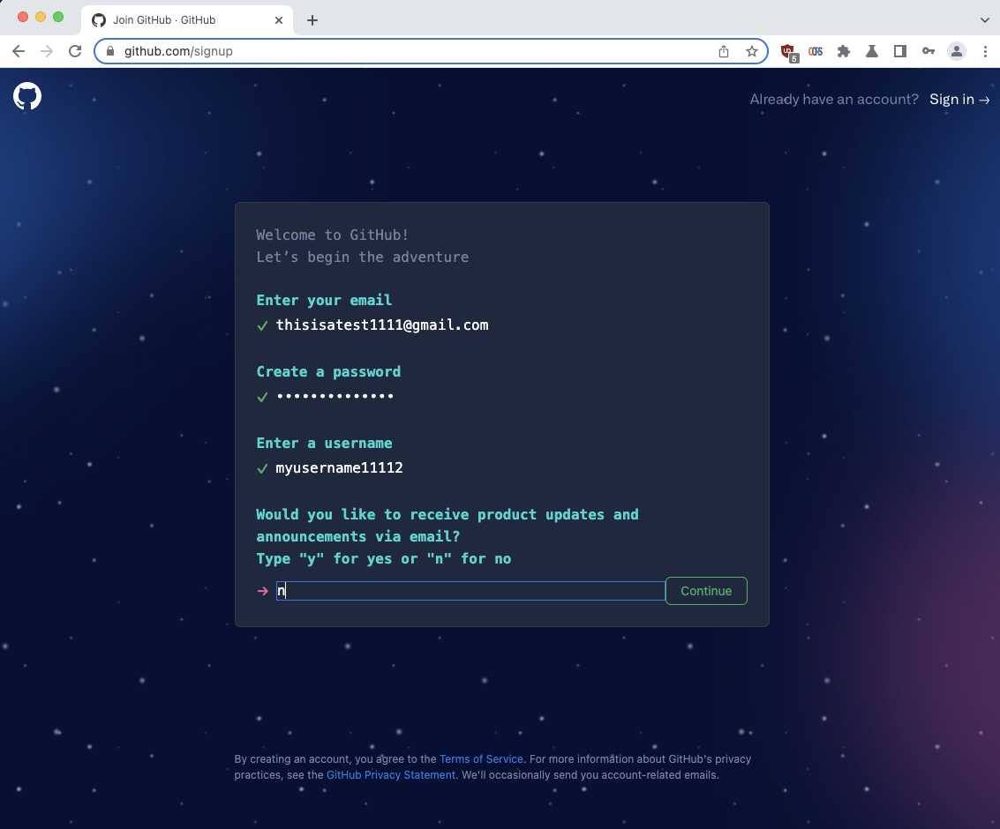
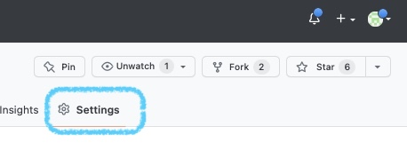
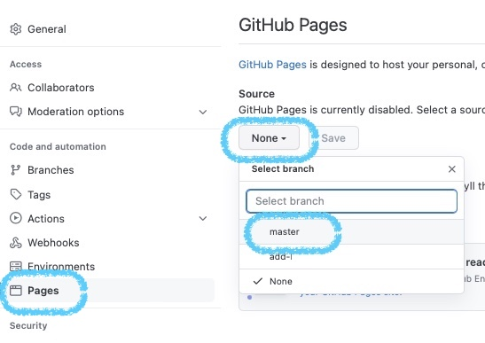
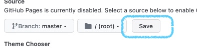
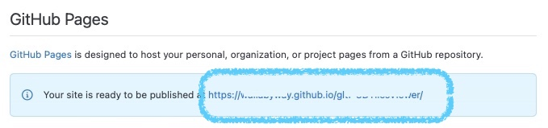
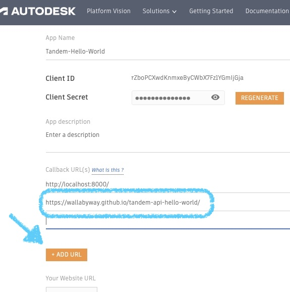

# Hosting "Hello World" on Github Pages

Let's make 'hello world' accessible from a public website.  We will use Github-Pages, a free service, that is highly performant and easy to make changes.

You can then share this public URL to anyone, and they will see your custom Tandem Viewer, and 3D facility, after they click the login button.

### Creating a github Account

Click [https://github.com/signup](https://github.com/signup) and fill in the details...

### Creating a Repo and index.html file

1. Click `+` and select `New repository`

2. Make it `Public`, select `Add a README file.` and click `Create repository`

3. Add a new empty `index.html` file.
4. Copy and paste the `index.html` code into this page
5. click `Submit` to save
 

# Setting up Github Pages

- Click `Settings`

- then select `Pages` on the left
- change the combo box from `None` to `master`

- and finally click `Save`

You should now see a `public URL` to your new website

# Configure the Auth Callback

Add the `public URL` to your Forge App `Callback URL(s)` list

- Click `Edit`
- Click `Add URL`
- type in your URL, ie. `https://wallabyway.github.io/tandem-api-hello-world/`
- scroll down and click `Save`

 
# Testing it

- Open a Browse 
- put your `public URL` in the address bar and go. ie. `https://wallabyway.github.io/tandem-api-hello-world/`

You should see your new web page !

- Click `Login` and watch Tandem Viewer display your facility in 3D ...! 

