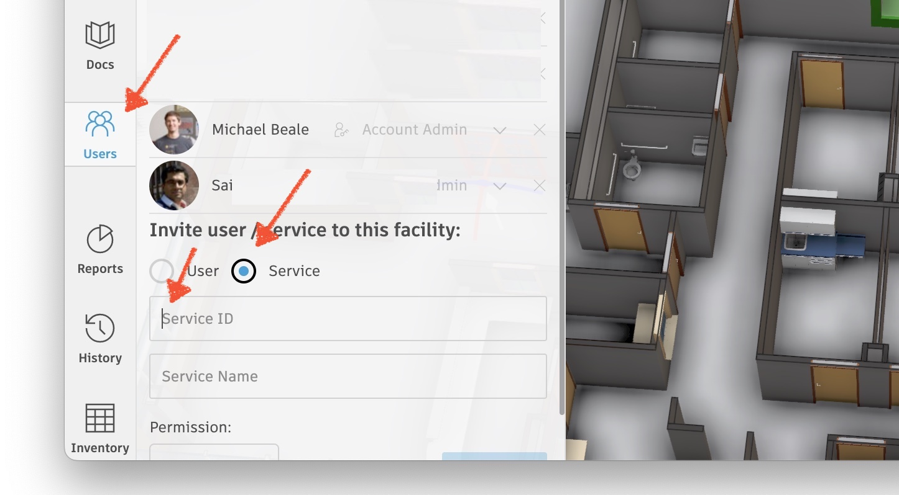

# Getting Started

The Tandem APIs lets you embed the Tandem Viewer, on your own webpage.

To get a basic 'hello world' example up and running, we need to setup 3-legged Authentication.  This involves 3 things:

1. Creating a Forge `Account` and Forge `Key`
2. Adding `Permissions` to Tandem
3. Creating a simple `"Hello World"` Tandem Viewer

### Creating a Forge Account and Forge Key

#### Forge Account

If you don't have a Forge account yet, sign up for one on [https://forge.autodesk.com](https://forge.autodesk.com). 

*You can take advantage of a trial subscription that is valid for 3 months.*

#### Forge Key

In order to authenticate to the Tandem platform, we need a Forge Key (ie. a client **ID** & client **Secret**).

Click "Go to My Apps" ...

Then click "Create App" ...

Fill in **name, description** with anything you like (ie. `hello world`). 

In the **Callback URL** add `http://localhost:8000`

Scroll to the bottom and click `Create App` and you'll see your newly generated `Forge Key` (**Client ID** and **Client Secret**)

Record the **Client ID**, you'll need this in the last step.

### Adding permissions to Tandem

Next, let's setup Tandem.  

We will add our Forge ID, as a User, to an existing Tandem Facility and give them `'Read Only'` permissions. 

- Open [any Tandem Facility](tandem.autodesk.com)
- Select `Users`
- Click `Service`
- Add your Forge `Client ID` into the `Service ID` field
- Add a `Hello World` to `Service Name` field
- Scroll down and click <button>ADD</button> button

### Creating a simple `"Hello World"` Tandem Viewer

Finally, let's create a simple `"Hello World"` webpage, containing a bare-bones Tandem Viewer, that shows our facility.

Click ['Hello World'](helloworld.md) tutorial to continue.

